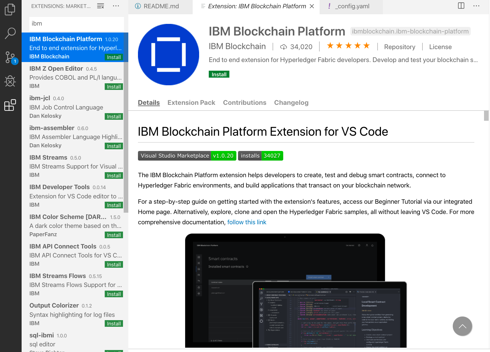

# How to Create a Supply Chain Blockchain App
Workshop by Lennart Frantzell and Grant Steinfeld given at workshops in Bay Area and New York 2020

## Components used
* IBM Blockchain Platform Extenstion for Visual Studio Code
* Hyperledger Fabric

## Prequisites

For IBM Blockchain Platform to work correctly the following tools and exacts versions need to be in place.

1. If you click on Code/About, confirm you have this `exact version of Visual Studio Code` ( Sept 2019 version `1.39.x` ) installed.


If not that's OK just 
[download the older version, 1.39.x from Microsoft here](https://code.visualstudio.com/updates/v1_39)

> TIP: Pin VSCode Version!! Be sure to change `Setttings/Update:Mode` to `manual`
<details><summary><strong>How to ...</strong></summary>
Pin this version for the duration of this workshop/blockchain discovery till stable release of ecosystem is availible. ( otherwise each vscode restart will update vscode!)
it 


</details>


## Great!  Now lets make sure you have all the other requirements:

1. node.js
1. npm
1. docker
1. docker-compose

check the versions by running these commands at your terminal

```bash
node -v
v10.16.3

npm -v
6.13.7

docker -v
Docker version 19.03.5, build 633a0ea

docker-compose -v
docker-compose version 1.25.4, build 8d51620a

```
if you have these, awesome!  otherwise see the detailed pre-requisites the VSCode IBM Blockchain platform extenstion for your computer's Operating System [here]()

### Start Microsoft Visual Studio Code and install the VSCode Extension for the IBM Blockchain Platform




### Start the FABRIC ENVIRONMENT 
tbd add image/video here ...

### and let us begin by following along with the instructors


>Create a simple Coffee Bean Supply Chain
Blockchain on Hyperledger Fabric 
>
>Part One: Setup Visual Studio Code to use the
IBM Blockchain Platform extenston.
>
>Start with the default project template
>
>Track the journey of Coffee Beans
From Farm to The Roaster 

### Follow along with the video 
Note this is a `silent video` for now.

[Create a simple Coffee Bean Supply ChainBlockchain on Hyperledger Fabric](https://youtu.be/5b7awLi93-E)


### Resources

Create a fair trade supply chain network – Use Hyperledger Fabric to increase efficiency in the supply chain of a coffee retailer – March 2019, IBM Code Pattern by Horea Porutiu and Grant Steinfeld via:
https://developer.ibm.com/patterns/coffee-supply-chain-network-hyperledger-fabric-blockchain-2/

[Forbes Blockchain 50](
https://www.forbes.com/sites/michaeldelcastillo/2020/02/19/blockchain-50/?linkId=82815201#5188e7877553)


#### Follow us on social media:

Grant Steinfeld

@gsteinfeld

Lennart Frantzell 

@LFrantzell 
