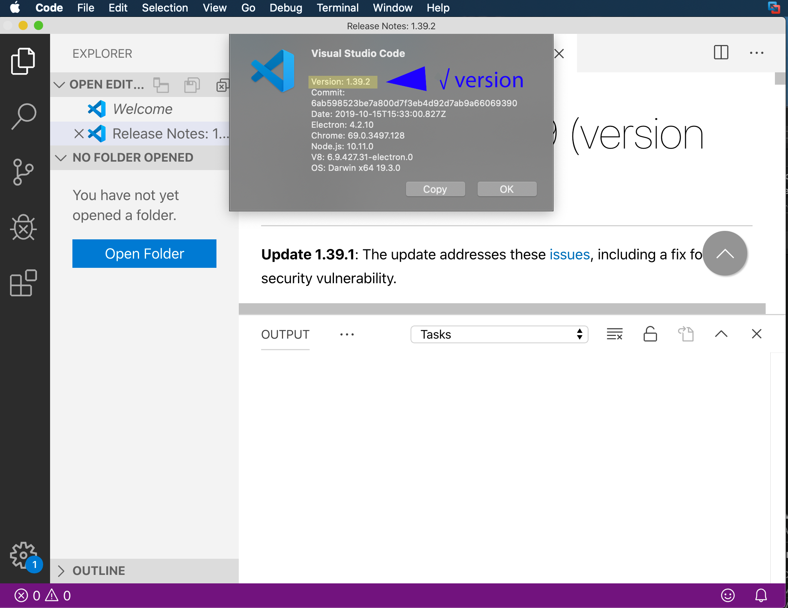

# coffee-supply-chain-blockchain
Workshop by Lennart Frantzell and Grant Steinfeld given at workshops in Bay Area and New York 2020


## Prequisites

For IBM Blockchain Platform to work correctly the correct version of tools need to be in place.

1. If you click on Code/About, confirm you have this `exact version of Visual Studio Code` ( Sept 2019 version `1.39.x` ) installed.



If not that's OK just 
[download the older version, 1.39.x from Microsoft here](https://code.visualstudio.com/updates/v1_39)

> Power User TIP: Be sure to change `Setttings/Update:Mode` to `manual`
<details><summary><strong>How to pin VSCode to it's current version</strong></summary>
Pin this version for the duration of this workshop/blockchain discovery till stable release of ecosystem is availible. ( otherwise each vscode restart will update vscode!)


</details>

Great!  Now lets make sure you have all the other requirements:

1. node.js
1. npm
1. docker
1. docker-compose

check the versions by running these commands at your terminal

```bash
node -v
v10.16.3

npm -v
6.13.7

docker -v
Docker version 19.03.5, build 633a0ea

docker-compose -v
docker-compose version 1.25.4, build 8d51620a

```
if you have these, awesome!  otherwise see the detailed pre-requisites the VSCode IBM Blockchain platform extenstion for your computer's Operating System [here]()
