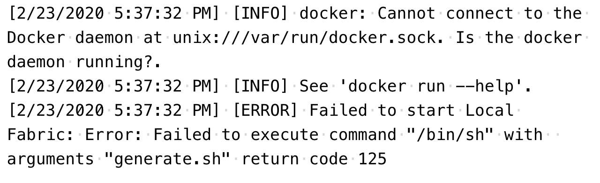
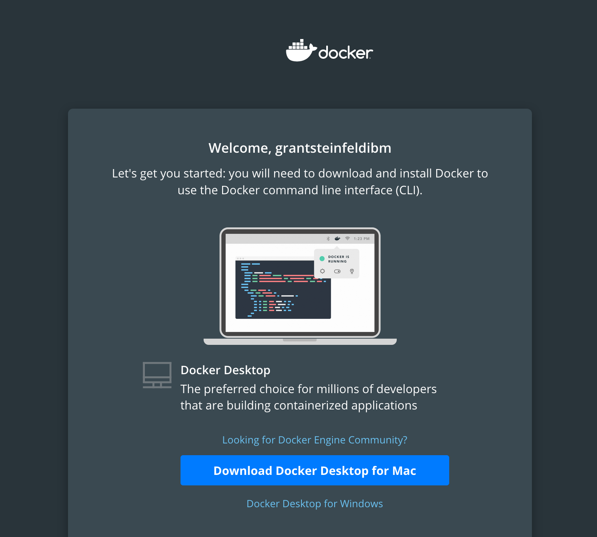

### Various challenges you may encounter when, trying to get your VSCode env setup


1. The `gRPC fails to rebuild` issue

According to the `IBM Blockchain Platform Extension updated to v1.0.20`
_Release date: February 20th 2020_

* We’re still waiting for the gRPC v1.25.0 binaries to be published so you may be affected by [this issue](https://github.com/IBM-Blockchain/blockchain-vscode-extension/issues/1621), where gRPC fails to rebuild when using VS Code 1.40.x.
   > Please see [this comment](https://github.com/IBM-Blockchain/blockchain-vscode-extension/issues/1621#issuecomment-552926559) for a workaround.

### 2. Failed to execute command "/bin/sh"




Solution check Docker is installed and running
properly.

Quick test run docker's hello world program:

```sh
docker run hello-world
```

To install sign up / login to [DockerHub](https://hub.docker.com/)

Mac users - Signup for a Docker Hub account to download docker desktop



#### 3. git fails to work - `xcrun: error`

This is probably seen only on a mac os, probably an os upgrade (e.g. Mojave to Catalina ) issue you will see on using git commands:

```bash
git status
xcrun: error: invalid active developer path (/Library/Developer/CommandLineTools), 
missing xcrun at: /Library/Developer/CommandLineTools/usr/bin/xcrun
```
dependancies on xcode!

```sh
xcode-select --install
```
You will be prompted to install command line developer tools!

[still having trouble with this one, read more here](https://tips.tutorialhorizon.com/2015/10/01/xcrun-error-invalid-active-developer-path-library-developer-commandline-tools-missing-xcrun/)
